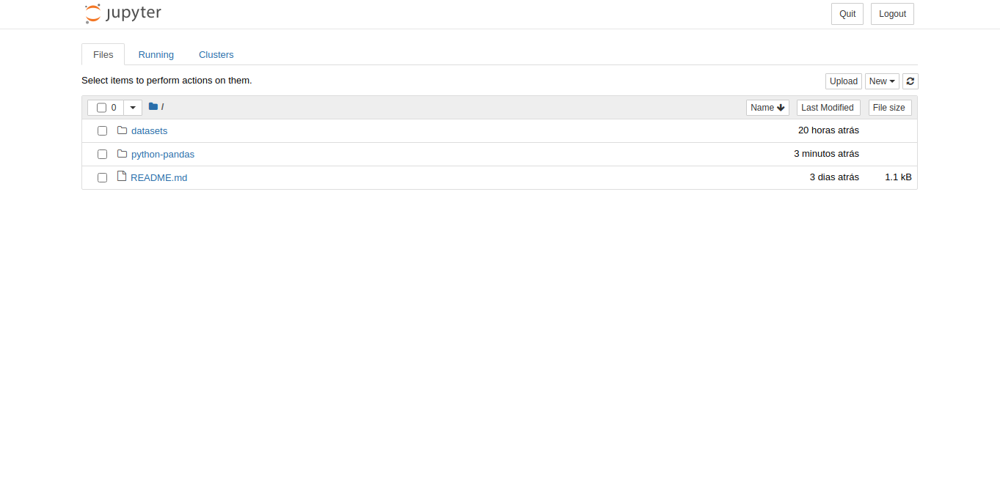

<p align="center">
  
</p>

Preparando o ambiente
=====================

Para que você possa participar da oficina sobre python/pandas é preciso que algumas ferramentas estejam disponíveis em sua máquina, para isso siga as instruções a seguir:

## Python e PIP

### Linux

Instale o Python 3 e o [PIP](https://pt.wikipedia.org/wiki/Pip_(gerenciador_de_pacotes)) (gerenciador de pacotes do python) seguindo essas [instruções](https://python.org.br/instalacao-linux/);

### Windows

Caso seu sistema operacional seja o Windows siga essas [instruções](https://python.org.br/instalacao-windows/);

## Pandas e Jupyter Notebook

1) Tendo o python e o pip instalados, execute o seguinte comando para proceder com a instalação do [pandas](https://pandas.pydata.org/):

```bash
$ pip install pandas
```

2) Após isso deve ser feita a instalação do [Jupyter Notebook](https://pt.wikipedia.org/wiki/Projeto_Jupyter), para isso execute o comando a seguir:

```bash
$ pip install notebook
```

3) Por fim execute o comando para iniciar o Jupyter Notebook:

```bash
cd dojos/python-pandas
jupyter notebook
```

Se tudo ocorrer de acordo, uma aba do seu navegador padrão abrirá automaticamente e mostrará os seguintes arquivos:



4) Note que Jupyter roda em um servidor local, ele ficará logando várias coisas em seu console, para finalizá-lo basta dar `Crtl+C`.
